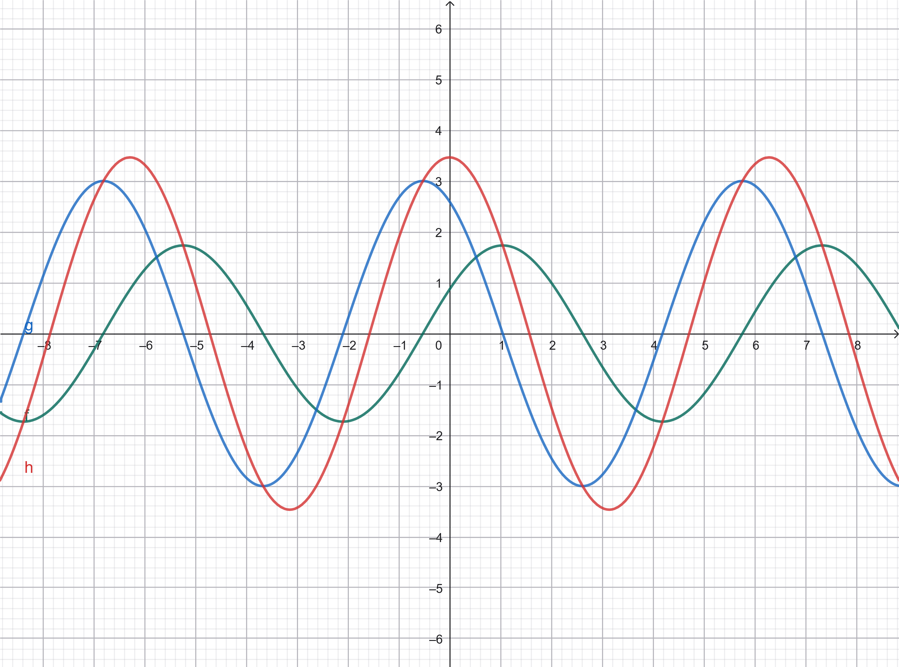
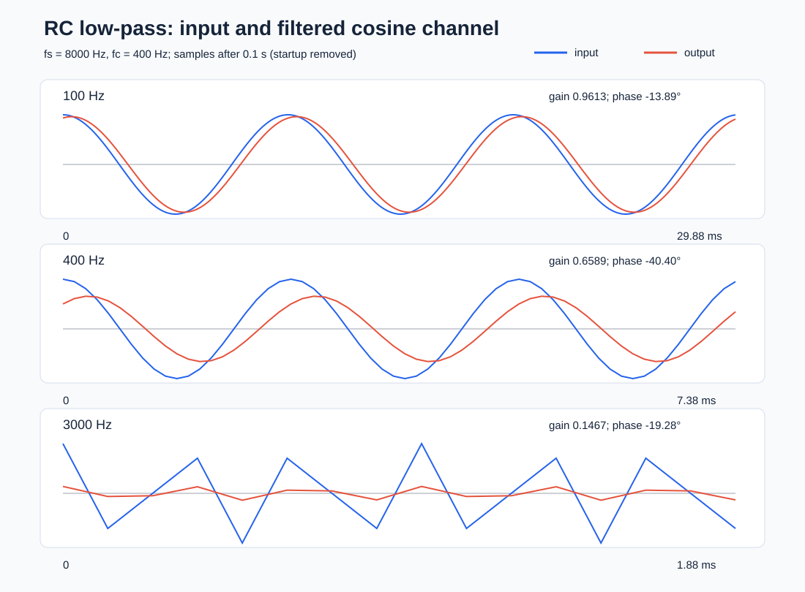

# HW1 — RC 低通濾波器數位模擬

題目來源：[NTPU dsp2026 HW1](https://github.com/cychiang-ntpu/dsp2026/tree/master/assignments/hw1_rc_lowpass)。本頁依序記錄 A1–A3、B1–B7 的 LaTeX 推導、C 程式、產生的 WAV 與實際量測圖。截止時間依老師題目為 **2026-10-08 18:00**。

> **繳交前待補：** 老師要求 A1–A3、B1–B6 的本人手寫推導掃描。以下公式可作為親手書寫與檢查的依據；收到本人手寫照片後，放入 `figure/handwritten/` 並在這裡嵌入。A3 已附 GeoGebra 匯出圖片，但公開分享連結仍待 GeoGebra 登入並儲存後補上。

## 檔案與如何重現

| 檔案 | 用途 |
|---|---|
| `sine_wav_gen.c` | 產生左聲道 sine、右聲道 cosine 的 16-bit PCM WAV。右聲道是複數訊號的實部，左聲道是虛部。振幅設為 0.8，以避免量化溢位。 |
| `RC_filtering.c` | 從 WAV 標頭讀取取樣率，以 400 Hz 截止頻率對每個聲道獨立套用式 (8)，初始值為 $y[-1]=0$。支援單／雙聲道 PCM16。 |
| `analyze.py` | 只用 Python 標準函式庫讀取 WAV、估計複數振幅比與相位，繪製 SVG 圖。 |
| `audio_examples/` | 100、400、3000 Hz 在 8000 Hz 取樣率下，濾波前後各一個 WAV。 |
| `figure/` | GeoGebra 圖與濾波波形比較。 |

在 `hw1/` 內執行以下命令。Windows 的 GCC 輸出檔名改為 `.exe` 即可。

```sh
gcc -std=c11 -O2 -Wall -Wextra sine_wav_gen.c -o sine_wav_gen -lm
gcc -std=c11 -O2 -Wall -Wextra RC_filtering.c -o RC_filtering -lm
./sine_wav_gen 8000 3000 1.0 input.wav
./RC_filtering input.wav output.wav
python analyze.py audio_examples figure
```

程式拒絕 $f\ge f_s/2$ 的產生要求，避免把超過奈奎斯特頻率的類比弦波誤當成原頻率；B5–B6 仍以數學方式分析 $f_s=4000$、$f=3000$ 的混疊情況。WAV 使用小端序 RIFF 標頭與交錯雙聲道樣本；濾波器保留取樣率、聲道數與樣本總數，輸出標準 PCM16 WAV。

## Part A：相子暖身

令 $\theta=\omega t$。已知

$$X(t)=\sqrt3\cos(\theta-\pi/3),\qquad
Y(t)=3\sin(\theta+2\pi/3).$$

### A1　三角恆等式

先用和差角展開（亦可由和差化積得到相同係數）：

$$\begin{aligned}
X(t)&=\sqrt3\left(\cos\theta\cos\frac\pi3+\sin\theta\sin\frac\pi3\right)
=\frac{\sqrt3}{2}\cos\theta+\frac32\sin\theta,\\
Y(t)&=3\left(\sin\theta\cos\frac{2\pi}3+\cos\theta\sin\frac{2\pi}3\right)
=\frac{3\sqrt3}{2}\cos\theta-\frac32\sin\theta,\\
Z(t)&=X(t)+Y(t)=\boxed{2\sqrt3\cos\theta}.
\end{aligned}$$

兩個 $\sin\theta$ 項抵銷；$Z$ 的振幅是 $2\sqrt3$、相位是 0。

若直接使用**和差化積**，令 $a=\theta-\pi/3$、$b=\theta+\pi/6$，先將 $Y=3\cos b$，則

$$\begin{aligned}
Z&=\frac{\sqrt3+3}{2}(\cos a+\cos b)
 +\frac{\sqrt3-3}{2}(\cos a-\cos b)\\
&=\frac{\sqrt3+3}{\sqrt2}\cos(\theta-\pi/12)
 +\frac{\sqrt3-3}{\sqrt2}\sin(\theta-\pi/12)
 =2\sqrt3\cos\theta.
\end{aligned}$$

### A2　相子

統一使用餘弦作為實部。因為 $\sin(\theta+2\pi/3)=\cos(\theta+\pi/6)$，

$$\begin{aligned}
\widetilde X&=\sqrt3 e^{-j\pi/3}=\frac{\sqrt3}{2}-j\frac32,\\
\widetilde Y&=3e^{j\pi/6}=\frac{3\sqrt3}{2}+j\frac32,\\
\widetilde Z&=\widetilde X+\widetilde Y=2\sqrt3.
\end{aligned}$$

因此 $Z(t)=\Re\{\widetilde Z e^{j\omega t}\}=2\sqrt3\cos(\omega t)$，與 A1 相同。

### A3　GeoGebra

在 [GeoGebra 繪圖計算機](https://www.geogebra.org/calculator) 輸入 `f(x)=sqrt(3)*cos(x-pi/3)`、`g(x)=3*sin(x+2*pi/3)`、`h(x)=f(x)+g(x)`。下圖為直接從 GeoGebra 匯出的曲線；綠色 $f$、藍色 $g$、紅色 $h$。紅色曲線在 $x=0$ 的值為 $2\sqrt3\approx3.464$，驗證 A1–A2。



## Part B：RC 低通濾波器

設 $T=RC$。本題 $R=1000\,\Omega$，且

$$C=\frac{1}{2\pi\cdot400\cdot1000}=3.97887358\times10^{-7}\,\mathrm{F}.$$

所以 $T=1/(2\pi\cdot400)=3.97887358\times10^{-4}\,\mathrm{s}$，截止頻率 $f_c=1/(2\pi RC)=400\,\mathrm{Hz}$。由 KVL，

$$x(t)=T\frac{dy(t)}{dt}+y(t).$$

### B1　連續時間穩態

對 $x(t)=e^{j\Omega t}$，設穩態 $y(t)=H(\Omega)e^{j\Omega t}$，代回微分方程：

$$1=(1+j\Omega T)H(\Omega),\qquad
\boxed{H(\Omega)=\frac1{1+j\Omega T}}.$$

因此

$$|H(\Omega)|=\frac1{\sqrt{1+(\Omega T)^2}},\qquad
\angle H(\Omega)=-\tan^{-1}(\Omega T).$$

對實數餘弦輸入，取實部即可得到輸出 $|H|\cos(\Omega t+\angle H)$。

### B2　開啟於 $t=0$ 的輸入

對 $x(t)=e^{j\Omega t}u(t)$，假設電容在開啟前沒有電壓，亦即 $y(0^-)=0$。齊次解為 $K e^{-t/T}$；由 $y(0^+)=0$ 得 $K=-H(\Omega)$：

$$\boxed{y(t)=H(\Omega)\left(e^{j\Omega t}-e^{-t/T}\right)u(t)}.$$

第一項是穩態，第二項是暫態。暫態以時間常數 $T\approx0.398$ ms 指數衰減。若初始電壓不是零，暫態係數也會不同。

### B3–B4　100、400、3000 Hz 的連續時間結果

令 $\Omega=2\pi f$，則 $\Omega T=f/400$。以單位振幅餘弦為例，穩態輸出是 $|H|\cos(2\pi ft+\phi)$；開啟於零時的完整複數解由 B2 的公式代入同一列 $H$ 即得。

| $f$ (Hz) | $f/f_c$ | $\lvert H\rvert$ | $\phi$ (度) | 觀察 |
|---:|---:|---:|---:|---|
| 100 | 0.25 | 0.970143 | −14.036 | 低頻幾乎通過 |
| 400 | 1 | 0.707107 | −45.000 | 截止點，振幅為 $1/\sqrt2$ |
| 3000 | 7.5 | 0.132164 | −82.405 | 高頻明顯衰減 |

### B5　離散式與頻率響應

取樣間隔 $\tau=1/f_s$，以後向差分近似 $dy/dt\approx(y[n]-y[n-1])/\tau$，得到老師的式 (8)：

$$\boxed{y[n]=\alpha y[n-1]+\beta x[n]},\qquad
\alpha=\frac{T}{T+\tau},\quad
\beta=\frac{\tau}{T+\tau}=1-\alpha.$$

對 $x[n]=e^{j\omega n}$ 且 $\omega=2\pi f/f_s$，穩態 $y[n]=H_d(e^{j\omega})e^{j\omega n}$，故

$$\boxed{H_d(e^{j\omega})=\frac{\beta}{1-\alpha e^{-j\omega}}}.$$

由實部與虛部可得

$$|H_d|=\frac{\beta}{\sqrt{(1-\alpha\cos\omega)^2+(\alpha\sin\omega)^2}},\qquad
\angle H_d=-\mathrm{atan2}(\alpha\sin\omega,1-\alpha\cos\omega).$$

### B6　不同取樣率與連續結果比較

下表每格是「振幅比／相位（度）」。相位使用 $(-180^\circ,180^\circ]$；數位頻率直接代入題目指定的 $f$，以呈現混疊。

| $f_s$ (Hz) | $\alpha$ | 100 Hz | 400 Hz | 3000 Hz |
|---:|---:|---:|---:|---:|
| 連續 | — | 0.970143 / −14.036° | 0.707107 / −45.000° | 0.132164 / −82.405° |
| 4000 | 0.614130 | 0.952787 / −13.722° | 0.623123 / −35.657° | 0.328813 / +31.555° |
| 8000 | 0.760943 | 0.961320 / −13.891° | 0.658896 / −40.399° | 0.146709 / −19.282° |
| 16000 | 0.864245 | 0.965695 / −13.967° | 0.681250 / −42.723° | 0.130302 / −50.030° |

$f_s=4000$ 時奈奎斯特頻率只有 2000 Hz，3000 Hz 取樣後等價於 **−1000 Hz** 的複數弦波；因此不能把該格當作對原始 3000 Hz 類比訊號的良好近似。即使 $f_s=8000$ 或 16000 可避免 3000 Hz 混疊，後向差分的數位濾波器在高頻仍和連續 RC 有可見差異。提高取樣率後，固定物理頻率下的結果逐漸接近連續公式。

### B7　C 實作與 WAV 驗證

`RC_filtering.c` 實際使用 $T=1/(2\pi\cdot400)$ 與 WAV 標頭中的 $f_s$ 計算 $\alpha,\beta$，每讀一個樣本就更新一次 $y[n]$。兩聲道各有自己的 $y[n-1]$，不會把左、右聲道混在一起。以 8000 Hz、1 秒的輸入檔，略過最初 0.1 秒暫態後，由「右 + $j$ 左」組成複數，估計輸出與輸入的複數係數比，得到：

| $f$ (Hz) | C 輸出實測振幅比 | C 輸出實測相位 | B5 理論振幅比 | B5 理論相位 |
|---:|---:|---:|---:|---:|
| 100 | 0.961323 | −13.891° | 0.961320 | −13.891° |
| 400 | 0.658896 | −40.400° | 0.658896 | −40.399° |
| 3000 | 0.146711 | −19.282° | 0.146709 | −19.282° |

微小誤差來自 16-bit PCM 的整數量化。波形圖中的藍線是輸入，紅線是濾波後；3000 Hz 僅有約 0.147 倍的輸出振幅。



## 繳交檢查

- [x] A1–A2 與 B1–B6 的 LaTeX 推導及數值結果
- [x] A3 GeoGebra 匯出圖片
- [x] `sine_wav_gen.c`、`RC_filtering.c`、WAV 與濾波比較圖
- [ ] 本人手寫推導照片／掃描，放入 `figure/handwritten/` 並嵌入本頁
- [ ] GeoGebra 登入後的作品分享連結
- [ ] 邀請老師加入私人 repository；在 LMS 填 repository URL 與完整 commit SHA
